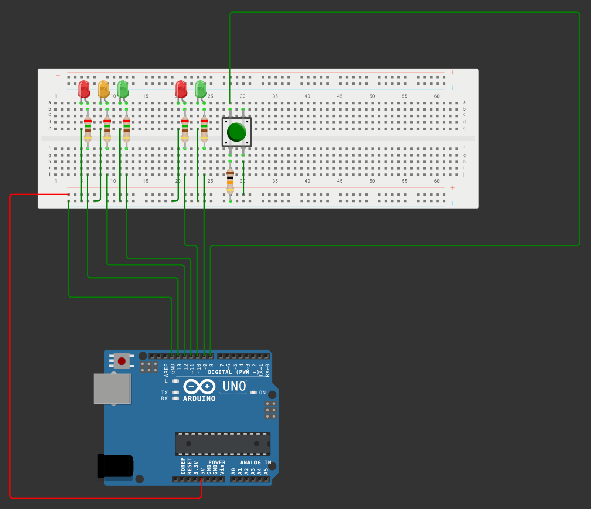

# Arduino-Timer-Blinker-Button-minilib
This library (header-only) is designed to call non-blocking Timer execution threads, alternating Timer (Blinker), and Button click processing. The library provides an interface for operation based on signals that need to be passed from one method to another

